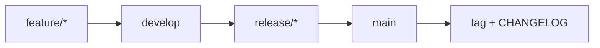

# Jak přispět do projektu {Název projektu}

Meta-shrnutí: Onboarding pro vývojáře – jak projekt zprovoznit lokálně, jaký je git flow a jaké konvence dodržovat. Cílová skupina: vývojáři, kteří do projektu přispívají.

## Obsah

- [Předpoklady](#předpoklady)
- [Zprovoznění lokálně](#zprovoznění-lokálně)
- [Git flow](#git-flow)
- [Konvence](#konvence)

## Předpoklady

| Nástroj | Verze | Poznámka |
|---|---|---|
| {.NET SDK} | {8.0} | |
| {Node.js} | {20 LTS} | pro frontend |
| {Docker} | {aktuální} | lokální DB/služby |

## Zprovoznění lokálně

```bash
git clone <REPO_URL>
cd {projekt}
# instalace závislostí, migrace, spuštění
```

> [!IMPORTANT]
> Lokální konfiguraci (connection stringy, klíče) drž v `appsettings.Development.json` nebo user-secrets. Do repozitáře necommituj credentials – používej placeholdery `<DB_PASSWORD>`, `<API_KEY>`.

## Git flow



- Vývoj na větvích `feature/{ticket-id}-{krátký-popis}`.
- Pull request míří do `develop`, vyžaduje review a zelené testy.
- {Doplň pravidla pro release a hotfix dle vašeho procesu.}

## Konvence

- Commit message: {např. Conventional Commits – `feat(billing): ...`}.
- Code style: {odkaz na .editorconfig / linter}.
- Každá změna chování → záznam do [CHANGELOG.md](./CHANGELOG.md).
