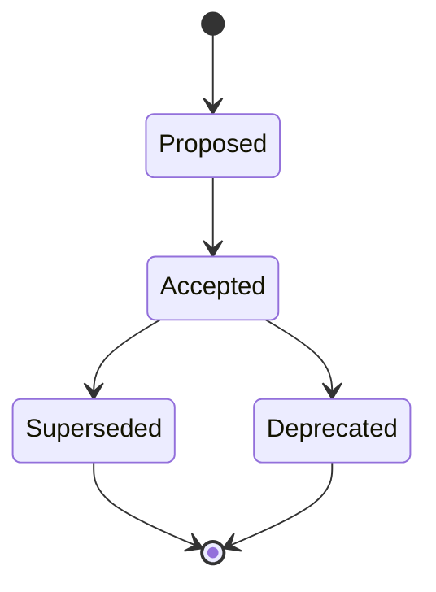

# Pravidla pro ADR (Architecture Decision Records)

Meta-shrnutí: Referenční pravidla pro dokumentaci architekturních rozhodnutí formou ADR záznamů ve složce `docs/adr/` – formát, číslování, životní cyklus a index. Cílová skupina: Claude při tvorbě a údržbě ADR.

## Obsah

- [Co je ADR a kdy ho psát](#co-je-adr-a-kdy-ho-psát)
- [Umístění a pojmenování](#umístění-a-pojmenování)
- [Struktura záznamu](#struktura-záznamu)
- [Životní cyklus (Status)](#životní-cyklus-status)
- [Index v README.md](#index-v-readmemd)
- [Co nikdy nedělat](#co-nikdy-nedělat)

## Co je ADR a kdy ho psát

ADR (Architecture Decision Record) zachycuje **jedno architekturní rozhodnutí** – proč vzniklo, co bylo rozhodnuto, jaké to má důsledky a jaké alternativy byly zváženy. ADR piš, když rozhodnutí:

- ovlivňuje strukturu, technologii nebo závislosti projektu (volba databáze, message brokeru, frameworku, integračního vzoru),
- bude se na něj někdo v budoucnu ptát „proč to tak je?",
- je obtížně vratné nebo drahé na změnu.

ADR **není** dokumentace návrhu (ta patří do `docs/development/`) ani changelog. ADR odpovídá na otázku „proč", ne „jak to funguje".

## Umístění a pojmenování

Všechny ADR žijí ve složce `docs/adr/`:

```text
docs/adr/
├── README.md                          # index všech rozhodnutí
├── 0001-volba-message-brokeru.md
├── 0002-oddeleni-billing-od-fis.md
└── 0003-prechod-na-mariadb.md
```

- Soubory čísluj **sekvenčně čtyřmístně**: `0001-nazev.md`, `0002-nazev.md`, … Číslo se po přidělení nikdy nemění ani nerecykluje.
- Název za číslem: malá písmena, slova spojená pomlčkou, bez diakritiky – stejná konvence jako zbytek `docs/` (viz [`struktura-repozitare.md`](./struktura-repozitare.md)).
- Před vytvořením nového ADR zjisti nejvyšší existující číslo a použij následující.

## Struktura záznamu

Každý ADR má pevnou kostru – použij šablonu [`assets/adr-template.md`](../assets/adr-template.md):

| Sekce | Obsah |
|---|---|
| `# ADR-XXXX: Název` | H1 s číslem a výstižným názvem rozhodnutí |
| Metadata | `Status`, datum, případně autoři |
| `## Kontext` | Proč rozhodnutí vzniklo – problém, omezení, síly, které na rozhodnutí tlačí |
| `## Rozhodnutí` | Co bylo rozhodnuto – aktivní formulací („Použijeme RabbitMQ…") |
| `## Důsledky` | Pozitivní **i negativní** dopady. Negativní důsledky nezamlčuj – jsou nejcennější částí záznamu |
| `## Zvážené alternativy` | Jaké možnosti byly na stole a proč neprošly |

> [!TIP]
> Kontext piš tak, aby mu rozuměl i čtenář za pět let bez znalosti tehdejší situace. Rozhodnutí bez kontextu je jen příkaz; s kontextem je to vysvětlení.

## Životní cyklus (Status)

Stav ADR vyjadřuje pole `Status` v metadatech záznamu:



| Status | Význam |
|---|---|
| `Proposed` | Návrh rozhodnutí, čeká na schválení |
| `Accepted` | Rozhodnutí platí a řídí se jím vývoj |
| `Deprecated` | Rozhodnutí už neplatí, bez přímé náhrady |
| `Superseded by ADR-XXXX` | Rozhodnutí nahrazeno novějším ADR – uveď číslo náhrady |

Při nahrazení rozhodnutí:

1. Vytvoř **nový ADR** s dalším pořadovým číslem a statusem `Proposed`/`Accepted`.
2. V novém ADR v Kontextu odkaž na nahrazovaný záznam (relativním odkazem).
3. Ve starém ADR změň `Status` na `Superseded by ADR-XXXX` a přidej relativní odkaz na nový soubor.
4. Aktualizuj index v `README.md`.

## Index v README.md

Složka `docs/adr/` obsahuje `README.md` jako rozcestník – tabulku všech rozhodnutí s číslem, názvem a aktuálním statusem:

```markdown
# Architekturní rozhodnutí (ADR)

Meta-shrnutí: Index všech architekturních rozhodnutí projektu. Cílová skupina: vývojáři a architekti.

## Index rozhodnutí

| ADR | Název | Status |
|---|---|---|
| [0001](./0001-volba-message-brokeru.md) | Volba message brokeru | Superseded by [ADR-0003](./0003-prechod-na-mariadb.md) |
| [0002](./0002-oddeleni-billing-od-fis.md) | Oddělení BILLING od FIS | Accepted |
| [0003](./0003-prechod-na-mariadb.md) | Přechod na MariaDB | Accepted |
```

Index aktualizuj **při každé změně** – nový ADR, změna statusu, supersede. ADR bez záznamu v indexu je osiřelý.

## Co nikdy nedělat

> [!CAUTION]
> ADR se **nikdy nemažou ani nepřepisují**. Superseded a Deprecated záznamy zůstávají v historii – právě ony vysvětlují, proč se projekt vyvíjel, jak se vyvíjel. Jediné povolené úpravy existujícího Accepted ADR jsou změna `Status` a doplnění odkazu na nahrazující záznam; obsahové změny rozhodnutí = nový ADR.

- Neměň zpětně obsah sekcí Kontext/Rozhodnutí/Důsledky u přijatého ADR.
- Nerecykluj čísla smazaných souborů (žádné by ani neměly existovat).
- Neslučuj více rozhodnutí do jednoho záznamu – jeden ADR = jedno rozhodnutí.
