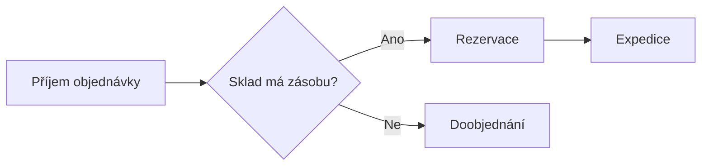

# Pravidla GitHub & AI-friendly formátování

Meta-shrnutí: Referenční zápis konkrétních Markdown konstrukcí, které dělají dokumentaci čitelnou v GitHubu i pro AI nástroje. Cílová skupina: Claude při psaní obsahu dokumentu.

## Obsah

- [Meta-shrnutí pod nadpisem](#meta-shrnutí-pod-nadpisem)
- [Table of Contents a kotvy](#table-of-contents-a-kotvy)
- [Relativní odkazy](#relativní-odkazy)
- [Alert blockquotes](#alert-blockquotes)
- [Bloky kódu](#bloky-kódu)
- [Tabulky](#tabulky)
- [Mermaid diagramy](#mermaid-diagramy)

## Meta-shrnutí pod nadpisem

Hned pod `# H1` napiš odstavec začínající `Meta-shrnutí:`. 1–3 věty, které řeknou **účel** dokumentu a jeho **cílovou skupinu**. Je to kontext pro RAG/AI – proto je oddělené a stručné, ne marketingový úvod.

```markdown
# Nasazení BILLING 2.0 do produkce

Meta-shrnutí: Krok za krokem postup pro nasazení BILLING 2.0 do produkčního prostředí přes Azure DevOps pipeline. Cílová skupina: DevOps inženýři s přístupem do produkce.
```

## Table of Contents a kotvy

Delší dokumenty (orientačně 3+ sekce) mají hned za meta-shrnutím sekci `## Obsah` s odrážkovým seznamem odkazů na vlastní `##` nadpisy.

GitHub generuje kotvu z nadpisu takto: malá písmena, mezery na pomlčky, diakritika **zachována** v URL-enkódované podobě. V Markdownu ale stačí napsat kotvu s diakritikou a malými písmeny:

```markdown
## Obsah

- [Předpoklady](#předpoklady)
- [Postup nasazení](#postup-nasazení)
- [Rollback](#rollback)
```

> [!TIP]
> Když nadpis obsahuje diakritiku, kotva ji obsahuje taky (`## Předpoklady` → `#předpoklady`). Mezery → pomlčky, interpunkce (`.`, `:`, `()`) se z kotvy vypouští.

## Relativní odkazy

Vždy relativní cesta, nikdy absolutní URL na GitHub:

```markdown
✅ [API specifikace](./api-specs.md)
✅ [Architektura](../development/architektura.md)
❌ [API specifikace](https://github.com/fullsys/app/blob/main/docs/development/api-specs.md)
```

Relativní odkazy fungují nativně v UI GitHubu, ve forku i v lokálním klonu. Absolutní odkazy se rozbijí při přesunu repozitáře nebo změně větve.

## Alert blockquotes

GitHub renderuje pět typů alertů. Používej je střídmě a smysluplně – ne každý odstavec je varování.

```markdown
> [!NOTE]
> Doplňující kontext, který je dobré vědět, ale není kritický.

> [!TIP]
> Doporučený postup nebo zkratka, která ušetří čas.

> [!IMPORTANT]
> Klíčová informace nutná k úspěchu úkolu.

> [!WARNING]
> Hrozí ztráta dat, výpadek nebo jiný vážný následek.

> [!CAUTION]
> Rizikové či nevratné operace – čti, než to spustíš.
```

| Alert | Použij na |
|---|---|
| `NOTE` | Kontext navíc, souvislosti |
| `TIP` | Doporučení, best practice, zkratka |
| `IMPORTANT` | Nutný předpoklad pro úspěch |
| `WARNING` | Vážný následek, ztráta dat |
| `CAUTION` | Nebezpečná/nevratná akce |

## Bloky kódu

Každý blok kódu má určený jazyk kvůli zvýraznění syntaxe a kvůli parsování AI nástroji:

````markdown
```csharp
public async Task<Invoice> GetInvoiceAsync(int id) =>
    await _repository.GetByIdAsync(id);
```

```bash
dotnet ef database update --connection "<CONNECTION_STRING>"
```

```sql
SELECT invoice_id, total FROM invoices WHERE customer_id = :customerId;
```
````

> [!CAUTION]
> Do ukázek kódu nikdy nevkládej reálné connection stringy, hesla ani PII. Použij placeholdery: `<CONNECTION_STRING>`, `<DB_PASSWORD>`, `user@example.com`, `customer-12345`.

## Tabulky

Tabulky používej na srovnání, parametry, mapování. Hlavička + zarovnání:

```markdown
| Parametr | Typ | Popis |
|---|---|---|
| `customerId` | int | Identifikátor zákazníka |
| `from` | date | Začátek období |
```

## Mermaid diagramy

Procesy, architekturu a stavy kresli Mermaidem v code bloku s jazykem `mermaid` – GitHub ho renderuje nativně. Je to preferovaný formát před PlantUML i obrázky.

````markdown

````

Vhodné typy: `flowchart` (procesy), `sequenceDiagram` (komunikace služeb/API), `erDiagram` (datový model), `stateDiagram-v2` (stavy entity).
