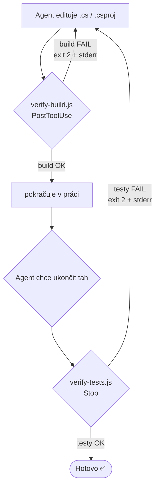

# dotnet-agentic-loop

Meta-shrnutí: Plugin s jedním skillem **`setup-agentic-loop`**, který v cílovém .NET repozitáři nastaví
deterministickou agentickou verifikační smyčku (build + testy jako automatický pass/fail gate) přes
[hooky Claude Code](https://code.claude.com/docs/en/hooks). Určeno pro .NET vývojáře, kteří chtějí, aby AI
agent sám uzavíral cyklus **gather context → take action → verify work → repeat** bez ruční kontroly člověkem.

## Obsah

- [O co jde](#o-co-jde)
- [Skilly](#skilly)
- [Jak smyčka funguje](#jak-smyčka-funguje)
- [Předpoklady](#předpoklady)
- [Instalace](#instalace)
- [Použití](#použití)
- [Co skill vytvoří v cílovém repu](#co-skill-vytvoří-v-cílovém-repu)
- [Bezpečnost](#bezpečnost)

## O co jde

Agentické „loop" programování stojí a padá na tom, že má agent **deterministický signál pravdy** — něco,
co bez zapojení člověka řekne „hotovo / nehotovo". U .NET projektů jsou tím signálem **build** a **testy**.

Skill se spustí **v cílovém .NET repozitáři** jako `/setup-agentic-loop` a projde šest kroků: analýza
projektu → zápis pravidel do `CLAUDE.md` → vygenerování hook skriptů z přiložených šablon → registrace
hooků v `settings.json` → volitelná monorepo optimalizace → ověření a shrnutí.

## Skilly

| Skill | Vyvolání | Co dělá |
|---|---|---|
| `setup-agentic-loop` | `/setup-agentic-loop` | Nastaví build + test verifikační smyčku v aktuálním .NET repu (hooky + pravidla v `CLAUDE.md`). |

## Jak smyčka funguje

Dva hooky drží agenta uvnitř verifikační smyčky. `verify-build.js` dává rychlou zpětnou vazbu po každé
editaci, `verify-tests.js` je závěrečný gate, který nepustí agenta „skončit" s červenými testy.



> [!NOTE]
> **Exit 2** je klíč: hook jím vrátí agentovi stderr jako zpětnou vazbu. U Stop hooku navíc **blokuje**
> ukončení tahu. Proti nekonečné smyčce chrání retry counter (strop 5 pokusů, reset po úspěchu). Souběžné
> spuštění více `dotnet` procesů nad stejným řešením hlídá sdílený zámek.

## Předpoklady

Tohle musí být k dispozici v prostředí **cílového** repozitáře, kde skill spouštíš:

| Nástroj | K čemu | Ověření |
|---|---|---|
| [Claude Code](https://code.claude.com/docs) | Spouští skill i hooky | `claude --version` |
| .NET SDK | `dotnet build` / `dotnet test` | `dotnet --version` |
| Node.js | Hook skripty jsou v Node.js | `node --version` |

## Instalace

```text
/plugin install dotnet-agentic-loop@fullsys-plugins
```

(Vyžaduje přidaný marketplace `fullsys-plugins` — viz kořenový [README](../../README.md).)

## Použití

1. Otevři Claude Code v **cílovém .NET repozitáři**.
2. Spusť skill:

   ```text
   /setup-agentic-loop
   ```

3. Skill sám najde `.sln`/`.csproj` a testovací projekty, odvodí build/test cíle a založí hooky.
4. Funkčnost ověř příkazem `/hooks` (zobrazí zaregistrované hooky) nebo spuštěním `claude --debug`
   (uvidíš log spouštění hooků).

> [!TIP]
> Před ostrým během si ověř, že baseline je zelený — `dotnet build` musí projít, než hooky začnou build
> vynucovat. Skill na to sám upozorní ve svém závěrečném shrnutí.

## Co skill vytvoří v cílovém repu

| Cesta | Účel |
|---|---|
| `.claude/hooks/verify-build.js` | PostToolUse hook — build po každé editaci `.cs`/`.csproj` |
| `.claude/hooks/verify-tests.js` | Stop hook — testy jako gate před dokončením tahu |
| `.claude/settings.json` | Registrace hooků (**merge** do existující konfigurace, nikdy přepis) |
| `CLAUDE.md` | Sekce s pravidly smyčky (build/test cíle, „úkol není hotový bez zelených testů") |
| `.gitignore` | Ignorování runtime souborů hooků (`.test-retry-count`, `.dotnet-lock/`, `.changed-files`) |

Šablony hooků jsou součástí pluginu ve složce
[`skills/setup-agentic-loop/assets/`](./skills/setup-agentic-loop/assets/); obsahují placeholdery
`{{BUILD_TARGET}}` / `{{TEST_TARGET}}`, které skill při běhu nahradí skutečnými cestami.

## Bezpečnost

- Hooky volají výhradně lokální `dotnet` CLI — **žádný odchozí síťový provoz** (v souladu s principem
  „no direct outbound calls from skills — use MCP servers").
- Runtime soubory hooků (`.test-retry-count`, `.dotnet-lock/`, `.changed-files`) se neverzují.
- **Schéma hooků se mezi verzemi Claude Code vyvíjí.** Pokud registrace nesedí, ověř ji proti aktuální
  [dokumentaci hooků](https://code.claude.com/docs/en/hooks).

Pravidla přispívání: viz kořenový [CONTRIBUTING.md](../../CONTRIBUTING.md).
